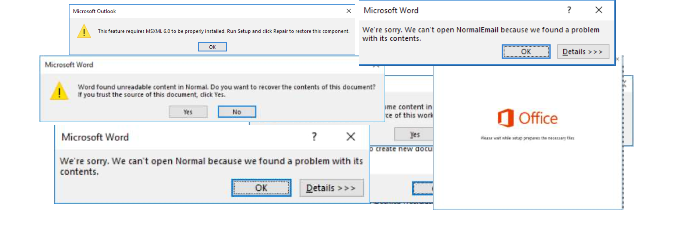

# COM Hijacking Techniques

\*\*\*\*

**Talk agenda**

* COM基本概念
* COM的CASE
* 进程加载时不安全的对象组件
* 识别系统上的劫持事件
* Hijack demos
* 稳定的COM劫持技术
* 在进攻时的实际用法
* 对Red/Blue Team的一些提示

**我为什么要来讨论Com Hijacking**

* COM在所有的Windows系统里面可以说是根深蒂固
* 这个接口可以有很多种利用方式
* 总会以意想不到的方式来进行利用
* COM劫持是一个可以让另外一个进程运行不安全代码的方法
* 权限维持&AV&横向渗透
* MITRE上有6个不同的组织滥用COM劫持技术来进行攻击
* 关于COM劫持，公开的信息很少

**WTF IS COM？**

* COM == "Computer Object Model" 
* Released in 1992 in Windows 3.1
* COM是许多Windows操作系统技术的核心构架
* OLE, ActiveX, COM+, DCOM, Windows shell, DirectX, UMDF, WinRT
* COM是促进程序交互操作性，代码重用和进程间通信的标准

**COM Example \#1**

* COM最初由Microsoft工程师创建，作为链接和对象共享的框架文档
* 通过COM，你可以访问Word中所有Excel API，而不用创建Excel进程

**COM Example \#2**

* 下面的代码很眼熟？
* 使用 Wscript.Shell COM 对象执行任意命令

**错误!未指定文件名。**

**Why COM？**

**应用程序需要一种共享对象和代码的方法**

* 静态的.lib链接库 === 开发人员必须针对您的库编译，重复库中浪费的空间--BAD
* 动态链接库dll === 没有版本控制 -- BAD
* COM == GOOD
* COM核心原则：实现与界面分离
* COM库可以通过任何语言和任意进程调用
* 可以在不破坏二进制级接口的情况下修改COM库

**COM server components**

* COM library === COM server
* COM服务器包含库的实现\(代码和类），以及用于的接口访问实施
* 其他想要与服务器交互的应用程序是COM客户端
* COM服务器可以在进程中\(DLL）或进程外\(EXE）托管
* COM类被赋予名称
*  ProgID: Friendly name \(LibraryName.ClassName.Version\)
*  CLSID: Unique name {5d58708c-5603-4ee0-81de-e88ec9ece235}
* COM接口也被命名为接口标识符\(IID），也是GUID
* 所有COM接口都有三种方法
* QueryInterface - 检索对象实现的接口的引用
* AddRef/Release - 递增/递减对象引用计数器

**COM客户端编程**

* COM客户端可以使用一下语言编写

* CoCreateInstance\(\)是用于激活对象的Windows API调用

--- CoGetClassObject\(\)用于检索指定CLSID接口的指针

--- CreateInstance\(\)用于创建未初始化的对象

* QueryInterface\(\)以确定服务器是否支持特定接口

---COM DLL导出DllGetClassObject\(\)，是通过QueryInterface\(\)调用的

* 如果您不知道对象的CLSID，请使用CLSIDFromProgID\(\)

**COM对象注册**

* COM对象能够使用regsvr32.exe
* 通过导出函数来完成

---DllRegisterServer

---DllUnregisterServer

**重要的子键**

* InprocServer/InprocServer32 -- 进程中的对象
* LocalServer/LocalServer32  -- 另外一个进程中扩展的COM对象
* InprocServer / LocalServer密钥用于向后兼容16位的exe和不常见的
* 32位和64位进程使用的是InprocServer32/LocalServer32

**COM对象注册注册表配置单元**

* 每个用户注册的Object：HKEY\_CURRENT\_USER\Software\Classes\CLSID
* class identifier\(类标识符）也称为CLASSID或CLSID，是与某一个类对象相联系的唯一标记\(UUID\)。一个准备创建多个对象的类对象应将其CLSID注册到系统注册数据库的任务表中，以使客户能够定位并装载与该对象有关的可执行代码。
* 全系统注册的CLSID：HKEY\_LOCAL\_MACHINE\Software\Classes\CLSID
* HKEY\_CLASSES\_ROOT\(HKCR）是一个虚拟注册表配置单元，显示合并后的视图HKCU和HKLM

**COM组件的使用情况调查**

HKLM多见于注册表

就是HKEY\_LOCAL\_MACHINE的简省写法

HKCU就是多见注册表

HKEY\_CURRENT\_USER 简省写法

HKCR多见于注册表

HKEY\_CLASSES\_ROOT简省写法

$HKCR\_keys = Get-CLSIDRegistryKeys -RegHive HKCR

$HKCR\_keys \| where-object {$\_ -like "\*inprocserver"} \| Measure-Object $HKCR\_keys \| where-object {$\_ -like "\*inprocserver32"} \| Measure-Object $HKCR\_keys \| where-object {$\_ -like "\*localserver"} \| Measure-Object $HKCR\_keys \| where-object {$\_ -like "\*localserver32"} \| Measure-Object

$HKLM\_keys = Get-CLSIDRegistryKeys -RegHive HKLM $HKLM\_keys \| Measure-Object

$HKCU\_keys = Get-CLSIDRegistryKeys -RegHive HKCU

$HKCU\_keys \| Measure-Object

Powershell cmdlets from https://github.com/nccgroup/Accomplice/COMHijackToolkit.ps1

代码作者还没传到github

**详细研究系统的COM组件**

* Microsoft’s Oleview, part of Windows SDK
* OLEViewDotNet- https://github.com/tyranid/oleviewdotnet/

OleViewDotNet是一个.NET 4应用程序，它提供了一个合并经典SDK的工具OleView和Test Container合并为一个应用程序。 它允许您通过查找COM对象

许多不同的视图（例如，CLSID，ProgID，服务器可执行文件），枚举接口，然后创建一个实例并调用方法。 它也有一个基本的容器攻击ActiveX对象，以便在操作时可以看到显示输出

数据。

**对象解析过程中的漏洞**

key加载范围：

1）每一个用户注册的Object：HKCU\Software\Classes\CLSID  &lt; -  有优先权

2）系统范围层面的Object：HKLM\Software\Classes\CLSID

用户的COM组件注册优先于系统范围的COM组件注册

* 这意味着在从HKLM读取key之前，会先从HKCU读取key
* 例外情况：升级过程会直接从HKLM读取，以防止琐碎的权限升级

如上所述，绝大多数对象都是在系统范围内注册的

* 向HKCU添加key无需特殊权限！
* 即使客户从HKCR\(HKLM + HKCU）读取key，也会在HKLM中复制CLSID

HKCU只会显示HKCU的价值

PS：

COM组件注册是指Windows编程中，为了使用自定义或第三方COM对象，对进程内组件（DLL）和进程外组件（EXE），利用自注册（self-registering）和非自注册组件程序而进行的操作。

**发现可劫持的Key**

* 测试机器是Win10专业版，安装了Chrome和office2016
* 由于key的数量最多，我们将重点关注下面的key
* 测试策略=识别激活的COM对象

--- 每隔一段时间

--- 在应用运行时

--- 常规动作\(打开文件，点击图标等等）

* 测试的时间大概五分钟
* Procmon filters:
* ○  Operation is RegKeyOpen 
* ○  Result is NAME NOT FOUND 
* ○  Path ends with InprocServer32 
* ○  Exclude if path starts with HKLM

过滤结果

将结果导出

工具识别

Extract-HijackableKeysFromProcmonCSV -CSVfile CaptureHKCUReads.CSV

**结果：有628种不同的InprocServer32 CLSID key可以劫持**

●  explorer.exe:122  

●  winword.exe:99  

●  powerpnt.exe:95  

●  excel.exe:90  

●  chrome.exe:87  

●  outlook.exe:85  

●  other: 50

**远程创建库**

●   InprocServer32 ：目标必须是 DLL  

●  DLL不需要有效的COM库  

○ 无需实现COM注册或接口查询功能

●  DLL 文件有一个初始化函数DllMain, 想要代码完美需要注意的点

○  只要进程加载或进程卸载时，DLLMAIN被调用  

○  每当进程创建或退出进程时，DLLMAIN被调用  

○  在COM激活的情况下，使用CoCreateInstance\(\)或CreateInstance\(\)调用CLSID 进程内COM服务器将触发DllMain  

●  在进入DllMain之前，系统范围内锁定  

● 加载程序锁的存在是为了解决 Windows加载程序的脆弱性

○  无法加载其他的DLL  

○  只能调用已经映射到内存中的函数 \(kernel32.dll\)  

○  不能锁定任何东西，或者等待任何锁被释放  

○  无法等待其他进程/线程完成

**DLLMAIN函数的实现**

BOOL APIENTRY DllMain\(HMODULE hModule, DWORD ul\_reason\_for\_call, LPVOID lpReserved\)

{

switch \(ul\_reason\_for\_call\) { case DLL\_PROCESS\_ATTACH: {

 DoEvilStuff\(NULL\);

break; }

case DLL\_THREAD\_ATTACH: case DLL\_THREAD\_DETACH: case DLL\_PROCESS\_DETACH:

break; }

 return TRUE;

}

**Option \#1: Create process**

//spawning a new process

DWORD WINAPI DoEvilStuff\(LPVOID lpParam\) {

STARTUPINFO info = { 0 };

PROCESS\_INFORMATION processInfo;

std::wstring cmd = L"C:\\Windows\\System32\\calc.exe";

BOOL hR = CreateProcess\(NULL, \(LPWSTR\)cmd.c\_str\(\), NULL, NULL,

if \(hR == 0\) { return 1;

}

return 0;

}

TRUE, 0, NULL, NULL, &info, &processInfo\);

**Option \#2: Thread injection**

* 派生新的进程
* 加载程序锁定时，我们可以安全地调用kernel32.dll中的函数

      ○ OpenProcess\(\)  
      ○ VirtualAllocEx\(\)  
      ○ WriteProcessMemory\(\)

      ○ CreateRemoteThread\(\)

* 有了这个方法，我们可以将shellcode注入到另外一个进程
* demo：[https://github.com/theevilbit/injection/blob/master/SimpleThreadInjection/SimpleThreadInjection/SimpleThreadInjection.cpp](https://github.com/theevilbit/injection/blob/master/SimpleThreadInjection/SimpleThreadInjection/SimpleThreadInjection.cpp)
* 优点：可以产生一个新的进程，执行我们的payload
* 缺点：shellcode会被查杀
* 更多的注入技术参考 https://github.com/theevilbit/injection

**Option \#3: CreateThread\(\)**

* 我们可以在COM客户端进程中运行吗？
* 我们可以在DLLmain中调用CreateThread\(\)，但是在DllMain退出之前线程不会运行和loader lock被释放
* 在DllMain中运行恶意代码的替代方法是在COM对象运行时运行shellcode
* DllGetClassObject\(\)是在激活COM对象时调用的导出函数
* DllGetClassObject\(\)中没有加载loader lock
* DllCanUnloadNow\(\) - 当客户端调用CoFreeUnusedLibraries\(\)来释放空间时，函数将被调用
* 返回S\_FALSE以告知客户端库仍在使用中，而不是卸载它

loader lock的解释

[https://stackoverflow.com/questions/13874324/what-is-a-loader-lock](https://stackoverflow.com/questions/13874324/what-is-a-loader-lock)

**COM client post-hijack behavior**

* 我们无法保证我们的线程会不会被杀死并且DLL会被卸载

○DLL名称和路径不是预期的

○DLL没有导出

○我们没有实现客户端所期望的COM接口

* COM客户端可能会崩溃或行为异常

**测试劫持后的线程生命周期**

●  一些 COM 客户端不在乎没有加载 COM 对象，线程保持运行  

●  一些 COM 客户端杀死线程，但保持 DLL 加载。其他完全崩溃  

●  一些例子 CLSIDs 你可以劫持而不被直接杀死或卸载 \(DllMain 和DllGetClassObject\):

○  excel.exe - {33C53A50-F456-4884-B049-85FD643ECFED}  

○  explorer.exe - {A4B544A1-438D-4B41-9325-869523E2D6C7}  

○  outlook.exe - {529A9E6B-6587-4F23-AB9E-9C7D683E3C50}  

○  chrome.exe - {1F486A52-3CB1-48FD-8F50-B8DC300D9F9D}  

●  繁琐的测试过程，对未来的稳定性没有保证  

●  在 DllMain 和 dllgetclass 对象中创建线程  

○ Dllgetclass object 可以调用多次

● 线程更新文件的进度

○ 你可以让这个函数做 “你想做的任何事情”，而不是创建和写入文件;\)  

○  注意在 DllMain 中创建的线程上的loader lock限制  

○  释放loader lock时启动线程

**Dll 的替代方案: scripts**

●  也许你不喜欢将 dll 放入目标环境  

●  COM 服务器可以是 Windows 脚本组件 \(.sct 文件\)  

●  文档来源于 @subtee and @enigma0x3

○ [https://www.slideshare.net/enigma0x3/windows-operating-system-archaeology](https://www.yuque.com/u212486/wing/gkcr73/pdf?toc=false&export_type=word&key=exports%3Adocx%3Adoc%3A2572279%3A1568034318000&x-yuque-fc-token=-ubfdEerIAhWHJOBk2yiNw%3D%3D%7CURw5__4uCIKdhoqsR5nQB6-xfMA3T-DRNvtJ9a57d1I%3D)  

●  InprocServer32 = C:\Windows\system32\scrobj.dll  

●  ScripletURL = 的位置.Sct 文件 \(本地磁盘或 URL\)  

●  蓝队注意: 这不是常见的事情

**劫持被遗弃的keys**

●  在某些情况下，会存在 CLSIDs Inprocserver32 key向一个没有存在于磁盘上的DLL  

●  大部分COM组件存活在C:\Windows\System32,仅由管理员可写

●  默认 Windows 没有任何缺少的COM服务  

●  具有第三方软件的系统 \(尤其是当软件组件已经被卸载\) 可能还会有更多  

●  旧版本 Google Chrome 留下的废弃keys 示例 \(注意: 文件夹仅 可写给管理员 ）

* Technique originally documented by @bohops: https://bohops.com/2018/06/28/abusing-com- registry-structure-clsid-localserver32-inprocserver32/

**ProgID解析劫持**

●  ProgIDs 是 COM 类的不可保证的唯一名称  

●  ProgIDs 解析为注册表项中的 CLSIDs:

○ HKCU\Software\Classes  
      ○ HKLM\Software\Classes  

●  可以通过在 HKCU 的 CLSID 映射中添加错误的 ProgID 来劫持 ProgID  

●  当客户端使用 ProgID 激活 COM 对象时，操作系统会去读取 HKCU\Software\class\ProgID

**TreatAs 劫持**

●  “TreatAs” 注册表项表示 CLSID 可以由另一个 CLSID 模拟  

●  最初由 @subtee 和 @enigma0x3 在他们的 Windows 操作系统中有记录   

●  TreatAs key指向另一个能够模拟当前 CLSID 的 CLSID  

●  所有的请求都转发给 TreatAs 中的CLSID   

● 如果仿真类没有实现正确的接口，就会出现程序不稳定  

1\)  在 HKCU 中创建恶意 CLSID时，需要选择目标 COM 服务器  

2\) 通过添加 TreatAs 子项来劫持合法的 CLSID，然后指向攻击者的 CLSID

**Persisting via COM hijack**

**COM hijacking primary use case: persistence**  

1\)  投放 SCT/DLL/EXE 到磁盘上  

2\)  在要劫持的 CLSID 下添加指向攻击者 COM 服务器的注册表项 \(如果滥用被废弃的key，则可选\)

a\)  InprocServer32 -&gt; DLL  

b\)  LocalServer32 -&gt; EXE  

c\)  InprocServer32 -&gt; Scrobl, ScriptletURL -&gt; SCT file  

d\) TreatAs/ProgID

3\)  Wait for CLSID to be activated  

●  不是常规手法  

●  不需要重启  

●  COM hijacks 系统内部自动运行不可见

**COM proxying**

对DllGetClassObject签名:

HRESULT DllGetClassObject\(REFCLSID rclsid, REFIID iid, LPVOID\*ppv\)

当 COM 客户端加载库的 DllGetClassObject 函数时:

1\)  Start a thread DoEvilStuff\(\)  

2\)  给定 rclsid 参数，从注册表读取 COM DLL 位置  

3\)  加载合法 DLL  

4\)  在合法库中查找 DllGetClassObject 的地址  

5\) 将参数传递给合法 DLL 中的 DllGetClassObject  

6\) 在 DllCanUnloadNow 中，等待执行DoEvilStuff\(\) 完成后再卸载  

我们可以加载库并等待线程执行，因为在加载过程中没有调用 dllgetclass object 锁

Thanks Leo!

[https://github.com/leoloobeek/COMProxy/](https://www.yuque.com/u212486/wing/gkcr73/pdf?toc=false&export_type=word&key=exports%3Adocx%3Adoc%3A2572279%3A1568034318000&x-yuque-fc-token=-ubfdEerIAhWHJOBk2yiNw%3D%3D%7CURw5__4uCIKdhoqsR5nQB6-xfMA3T-DRNvtJ9a57d1I%3D)

**通过COM去劫持计划任务处理程序**

文档来源:

[https://enigma0x3.net/2016/05/25/userland-](https://www.yuque.com/u212486/wing/gkcr73/pdf?toc=false&export_type=word&key=exports%3Adocx%3Adoc%3A2572279%3A1568034318000&x-yuque-fc-token=-ubfdEerIAhWHJOBk2yiNw%3D%3D%7CURw5__4uCIKdhoqsR5nQB6-xfMA3T-DRNvtJ9a57d1I%3D)

[persistence-with-scheduled-tasks-and-com-handler-hijacking/](https://www.yuque.com/u212486/wing/gkcr73/pdf?toc=false&export_type=word&key=exports%3Adocx%3Adoc%3A2572279%3A1568034318000&x-yuque-fc-token=-ubfdEerIAhWHJOBk2yiNw%3D%3D%7CURw5__4uCIKdhoqsR5nQB6-xfMA3T-DRNvtJ9a57d1I%3D)

schtasks /query /xml /tn '\Microsoft\Windows\Shell\CreateObjectTask

[https://github.com/enigma0x3/Misc-PowerShell-Stuff/blob/master/Get-ScheduledTaskComHandler.ps1](https://github.com/enigma0x3/Misc-PowerShell-Stuff/blob/master/Get-ScheduledTaskComHandler.ps1)

**Process injections via COM hijack**

●进程注入是一种逃避技术，其中恶意代码可以做到让其他人运行系统上的进程

●有许多记录在案的技术

●COM劫持是一种将代码注入另一个进程的地址空间的独特方法而且仅通过注册表操作

●不调用“可疑”的Windows API

●通过映射哪些CLSID与哪些进程相关联，将劫持特定的key导致注入特定的过程

●缺点：潜在的“时间延迟”，直到事件发生时，然后触发劫持

**COM abuse**

●高级的攻击者希望融入他们正在运行的环境中

●这些技术不一定依赖于劫持，但可以与其他技术结合使用然后可以误导防御行动的技巧

●应用程序白名单绕过：调用任何的CLSID：

○ rundll32.exe -Sta {CLSID}或ProgID

○ 将CLSID作为参数的其他程序：xwizard.exe，mmc.exe，verclsid.exe，cscript.exe，wscript.exe，openwith.exe

●横向移动：DCOM

○远程注册表写入劫持CLSID\(如果滥用废弃的CLSID，则为可选）

○把DLL/EXE从远程主机文件系统上删除

○使用DCOM激活远程主机上的对象，或等待COM客户端在本地调用它

○@bohops记录的原文：

https://bohops.com/2018/04/28/abusing-dcom-for-yet-another-lateral-movement-technique/

**进攻要点**

●COM劫持不是一种广泛使用的持久性技术，您的目标环境可能无法检测此活动

●可以通过userland安装

●滥用COM接口可以为攻击性操作员提一些误导

●各种新颖的初始访问手法

●COM劫持可用于进程注入

○ 这会通过加载不受信任的代码来破坏应用程序代码的完整性

○ 不会绕过Microsoft,仍然实施Code Integrity Guard

○ 其他的应用程序可能无法阻止COM劫持加载不受信任的代码

**防守要点**

●COM劫持不是一种很广泛使用的持久性技术，您的SOC可能检测不到这种类似的活动

●软件通常不会为每个用户注册COM对象

○ 将key写入HKCU\Software\Classes\CLSID的任何进程一般不会经常发生，所以应该怀疑

○ SwiftOnSecurity的Sysmon应该配置跟踪HKCU CLSID的添加

○ 注意添加ScriptletURL key，其中InprocServer32键注册到scrobj.dll

●注意添加TreatAs key

●如果您的用户被广泛授予管理员权限，则攻击者可以避免HKCU通过HKLM修改劫持对象

○ HKLM是归TrustedInstaller所有

●检查系统是否有不需要的密钥。 在磁盘上没有DLL的情况下利用CLSID不需要对注册表有任何的修改

  
**对于开发人员来说**

如果您正在开发依赖于在用户空间运行的COM库的安全敏感问题或关键应用程序，并且您不希望有人使用COM劫持来加载恶意库的话,下面是一些建议：

●避免依赖Windows来解析COM服务器的位置

●确定库的位置\(注册表，文件系统检查）

●LoadLibrary\(\)加载DLL

●直接调用COM DLL上的DllGetClassObject以用来检索接口指针

其他建议：

●不要为不存在的COM服务器添加CLSID

●不要为删除的组件留下CLSID

  
**未来的工作**

●劫持进程外的COM服务器

●再去识别其他可滥用的注册表项

●使用COM劫持进行应用程序hook

●拦截/修改应用程序行为

●访问敏感数据

●使用Frida等检测框架可以更好地了解COM客户端行为

●被劫持时产生额外效果的物体。

例子：

○Matt Nelson：通过COM劫持绕过AMSI

https://enigma0x3.net/2017/07/19/bypassing-amsi-via-com-

服务器劫持/

○James Forshaw：在受保护的进程内执行ring0权限：https://googleprojectzero.blogspot.com/2017/08/bypassing-virtualbox-process-hardening.html

○依赖COM的其他用户进程？ AV/EDR，还有吗？

**Accomplice介绍**

https://github.com/nccgroup/Accomplice

COMHijackToolkit.ps1

●检查系统上的COM对象

●劫持对象

●劫持cleanup

POC DLL在本次演讲中展示

●用于从DllMain运行payload的POC

●通过DLL来衡量劫持的成功与否

●进程迁移

**Good Bye!**

原文地址:[https://www.slideshare.net/DavidTulis1/com-hijacking-techniques-derbycon-2019](https://www.slideshare.net/DavidTulis1/com-hijacking-techniques-derbycon-2019)

